#### 최초 작성일 : 2021.08.10(화)

# Boostcourse Java Back-end 과정 학습

여기서는 Boostcourse Spring Framework Web MVC 학습을 진행한다.

## 학습 환경

1. OS : MacOS
2. JDK : OpenJDK 11.0.5
4. Build Tools : Maven
5. Database : MySQL
6. IDE: IntelliJ IDEA Ultimate

## IntelliJ Spring Framework 프로젝트 설정 방법

### Maven 프로젝트 설정

1. IntelliJ에서 New Project 선택
   
2. `Maven` 선택, `org.apache.maven.archetypes:maven-archetype-webapp` 선택 후 Next 버튼 클릭
   
3. `GroupId`, `ArtifactId`, `Version` 설정 후 Next 버튼 클릭
   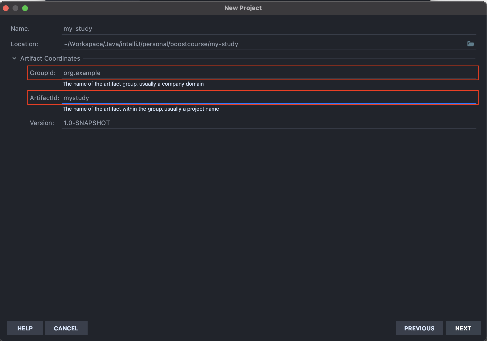
    - GroupId는 보통 프로젝트를 진행하는 회사나 팀의 도메인 이름을 거꾸로 적는다.
    - ArtifactId는 해당 프로젝트의 이름을 적는다.
    - Version은 보통 기본값(1.0-SNAPSHOT)으로 설정한다.
    - 여기서는 언급되지 않지만 `Package`라는 것이 있는데, 이는 GroupId와 ActifactId가 조합된 형태를 가진다.
4. Finish 버튼 클릭
   

### Spring Framework 프로젝트로 변경

1. 프로젝트 `우클릭 > Add Framework Support...` 클릭
   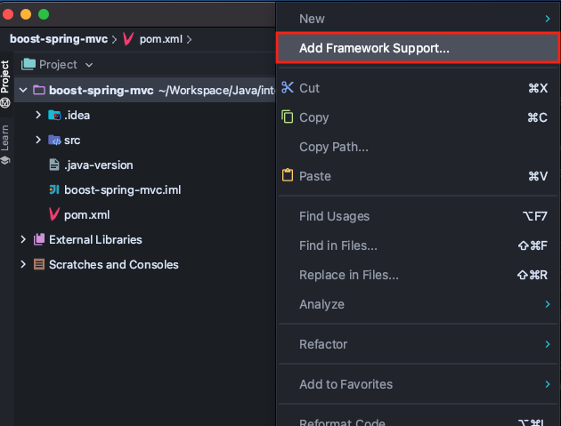
2. Spring MVC 선택 > Configure... 클릭
   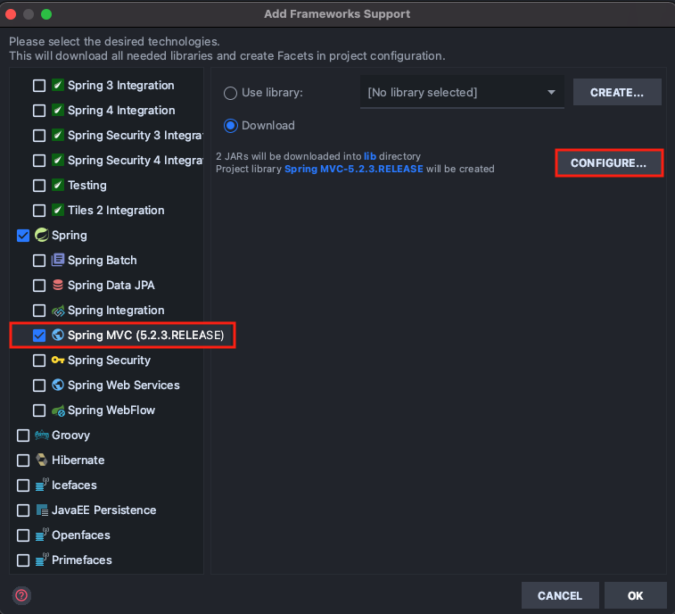
3. Configure 확인 후 OK
    - 스프링 버전인 이후에 Maven를 사용하여 알맞게 변경할 것이기 때문에 크게 신경쓸 필요 없다.
      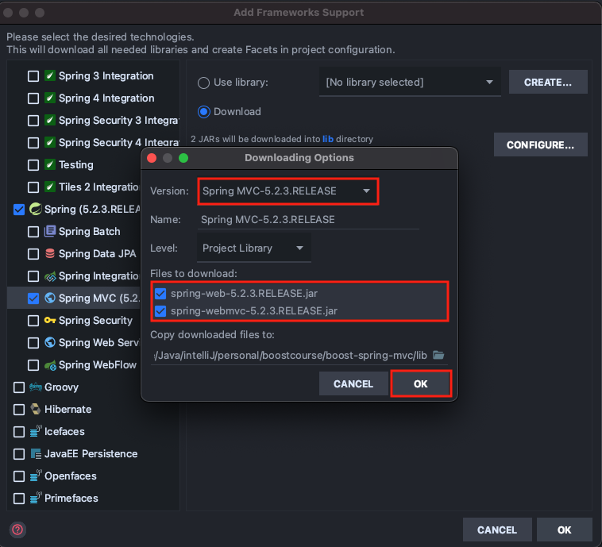
4. `lib` 폴더 삭제
    - Maven 빌드 도구를 이용하여 라이브러리를 사용할 것이기 때문에 삭제한다.
      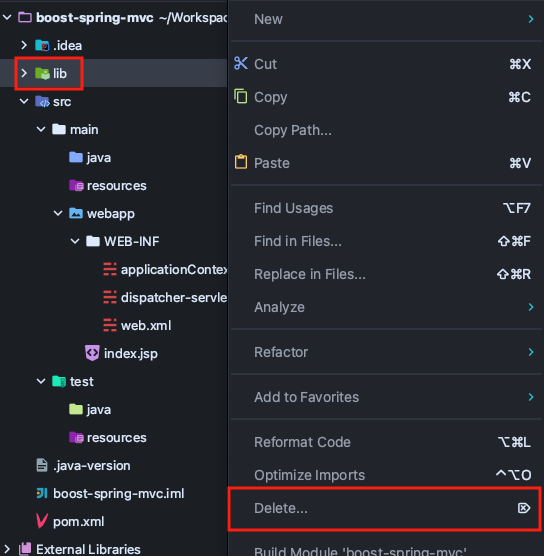
5. File > Projecdt Structure... > Libraires에서 등록되어 있는 라이브러리 모두 삭제
   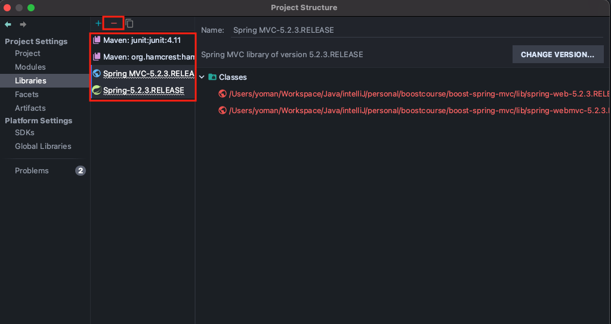
6. `pom.xml` 내용 변경
    - Spring Framework 라이브러리 추가
    - Build 설정
   ```xml
   <?xml version="1.0" encoding="UTF-8"?>
   <project xmlns="http://maven.apache.org/POM/4.0.0"
            xmlns:xsi="http://www.w3.org/2001/XMLSchema-instance"
            xsi:schemaLocation="http://maven.apache.org/POM/4.0.0
                                http://maven.apache.org/xsd/maven-4.0.0.xsd">
       <modelVersion>4.0.0</modelVersion>
       <groupId>kr.or.connect</groupId>
       <artifactId>springmvc</artifactId>
       <version>1.0-SNAPSHOT</version>
       <packaging>war</packaging>
       <name>springmvc Maven Webapp</name>
       <url>http://www.example.com</url>
       <properties>
           <project.build.sourceEncoding>UTF-8</project.build.sourceEncoding>
           <maven.compiler.source>11</maven.compiler.source>
           <maven.compiler.target>11</maven.compiler.target>
           <spring-version>4.3.5.RELEASE</spring-version>
       </properties>
   
       <dependencies>
           <!-- Spring Framework 라이브러리 추가 -->
           <dependency>
               <groupId>org.springframework</groupId>
               <artifactId>spring-context</artifactId>
               <version>${spring-version}</version>
           </dependency>
   
           <!-- Spring MVC 라이브러리 추가 -->
           <dependency>
               <groupId>org.springframework</groupId>
               <artifactId>spring-webmvc</artifactId>
               <version>${spring-version}</version>
           </dependency>
   
           <!-- JUnit 테스트 라이브러리 추가 -->
           <dependency>
               <groupId>junit</groupId>
               <artifactId>junit</artifactId>
               <version>4.11</version>
               <scope>test</scope>
           </dependency>
       </dependencies>
   
       <build>
           <finalName>springmvc</finalName>
           <!-- lock down plugins versions to avoid using Maven defaults (may be moved to parent pom) -->
           <pluginManagement>
               <plugins>
                   <plugin>
                       <artifactId>maven-clean-plugin</artifactId>
                       <version>3.1.0</version>
                   </plugin>
                   <!-- see http://maven.apache.org/ref/current/maven-core/default-bindings.html#Plugin_bindings_for_war_packaging -->
                   <plugin>
                       <artifactId>maven-resources-plugin</artifactId>
                       <version>3.0.2</version>
                   </plugin>
                   <plugin>
                       <artifactId>maven-compiler-plugin</artifactId>
                       <version>3.8.0</version>
                   </plugin>
                   <plugin>
                       <artifactId>maven-surefire-plugin</artifactId>
                       <version>2.22.1</version>
                   </plugin>
                   <plugin>
                       <artifactId>maven-war-plugin</artifactId>
                       <version>3.2.2</version>
                   </plugin>
                   <plugin>
                       <artifactId>maven-install-plugin</artifactId>
                       <version>2.5.2</version>
                   </plugin>
                   <plugin>
                       <artifactId>maven-deploy-plugin</artifactId>
                       <version>2.8.2</version>
                   </plugin>
               </plugins>
           </pluginManagement>
       </build>
   </project>
   ```
7. web.xml 내용 변경
    - 여기서는 XML 설정 파일이 아닌 `Java Config 파일`을 통해 Spring 설정을 읽어 들이도록 설정하였음.
   ```xml
   <?xml version="1.0" encoding="UTF-8"?>
   <web-app xmlns="http://xmlns.jcp.org/xml/ns/javaee"
            xmlns:xsi="http://www.w3.org/2001/XMLSchema-instance"
            xsi:schemaLocation="http://xmlns.jcp.org/xml/ns/javaee
                                http://xmlns.jcp.org/xml/ns/javaee/web-app_3_1.xsd" version="3.1">
       <display-name>Archetype Created Web Application</display-name>
       <servlet>
           <servlet-name>mvc</servlet-name>
           <servlet-class>org.springframework.web.servlet.DispatcherServlet</servlet-class>
           <init-param>
               <param-name>contextClass</param-name>
               <param-value>org.springframework.web.context.support.AnnotationConfigWebApplicationContext</param-value>
           </init-param>
           <init-param>
               <param-name>contextConfigLocation</param-name>
               <param-value>kr.or.connect.springmvc.WebMvcContextConfiguration</param-value>
           </init-param>
           <load-on-startup>1</load-on-startup>
       </servlet>
       <servlet-mapping>
           <servlet-name>mvc</servlet-name>
           <url-pattern>/</url-pattern>
       </servlet-mapping>
   </web-app>
   ```

### WAS(Tomcat 8.5) 설정

1. IntelliJ `우측 상단 Add Configuration...` 클릭
   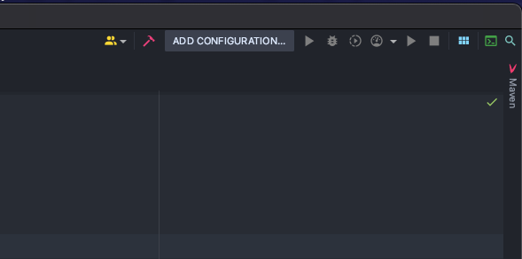
2. `+ 버튼 > Tomcat Server > Local`을 선택하여 톰캣 설정
   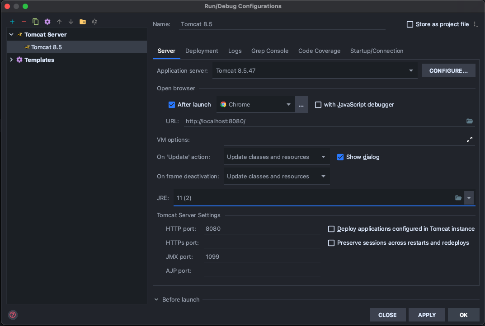
3. Deployment, Application context 설정
   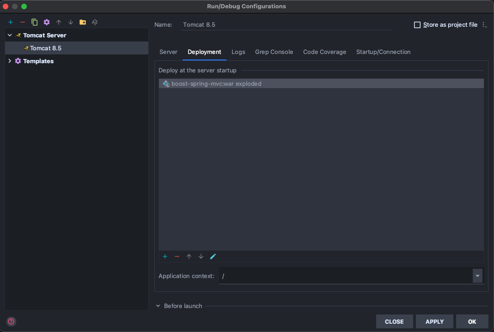

## Spring Framework Web MVC

1. MVC 설정시 사용하는 어노테이션
    - @Configuration
    - @EnableWebMvc
        - DispatcherServlet의 RequestMappingHandlerMapping, RequestMappingHandlerAdapter,
          ExceptionHandlerExceptionResolver, MessageConverter 등 `Web에 필요한 빈들을 대부분 자동으로 설정`해준다.
        - XML로 설정하는 경우 <mvc:annotation-driven/> 와 동일하다.
        - 기본 설정 이외의 설정이 필요하다면 `WebMvcConfigurerAdapter`를 상속받도록 Java config class를 작성한 후, 필요한 메소드를 오버라이딩 하도록 한다.
    - @ComponentScan

### 레이어드 아키텍처(Layered Architecture)

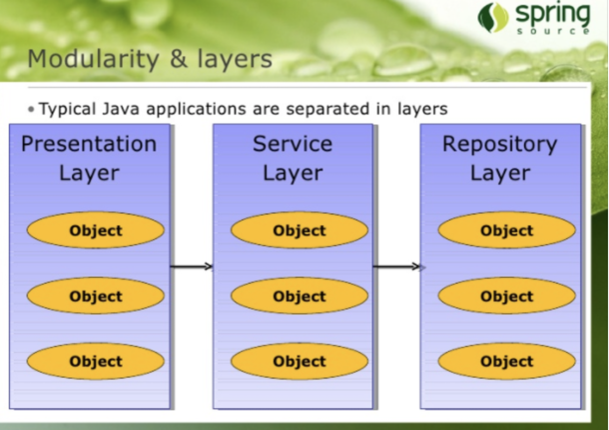

#### Controller에서 중복되는 부분을 처리하려면?

1. 별도의 객체로 분리
2. 별도의 메소드로 분리

##### 컨트롤러와 서비스

1. 업무와 관련된 비즈니스 메소드를 별도의 `Service 객체`에서 구현하도록 하고 컨트롤러는 Service를 이용하도록 한다.
   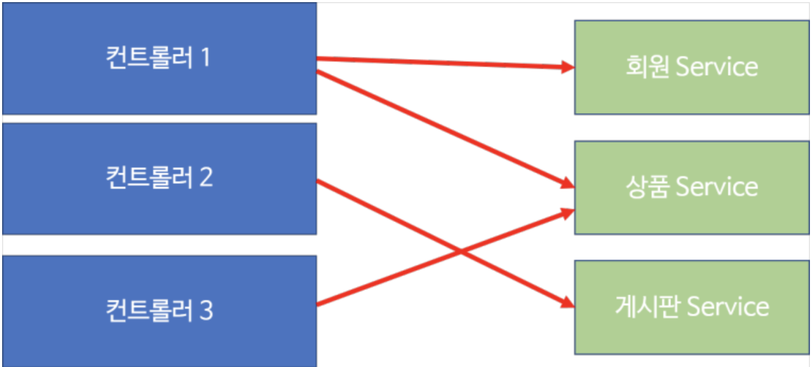

##### 서비스 객체

1. 비지니스 로직(Business logic)을 수행하는 메소드를 가지고 있는 객체를 서비스 객체라고 한다.
2. 보통 하나의 비지니스 로직은 하나의 `트랜잭션`으로 동작한다.

#### 트랜잭션(Transaction)이란?

1. 트랜잭션의 특징은 크게 4가지로 구분된다.
    - 원자성(Atomicity)
        - 예를 들어, '출금'이라는 기능의 흐름이 다음과 같다고 생각해 보자.
            1. 잔액이 얼마인지 조회한다.
            2. 출금하려는 금액이 잔액보다 작은지 검사한다.
            3. 출금하려는 금액이 잔액보다 작다면 (잔액 - 출금액)으로 수정한다.
            4. 언제, 어디서 출금했는지 정보를 기록한다.
            5. 사용자에게 출금한다.
        - 위의 작업이 4번에서 오류가 발생했다면 앞의 작업을 모두 원래대로 복원시켜야 한다.(`Rollback`)
        - 5번까지 모두 성공했을 때만 정보를 모두 반영해야 한다.(`Commit`)
    - 일관성(Consistency)
        - 트랜잭션이 진행되는 동안에 데이터가 변경되더라도 업데이트된 데이터로 트랜잭션이 진행되는 것이 아니라, 처음에 트랜잭션을 진행하기 위해 참조한 데이터로 진행되어야 한다.
    - 독립성(Isolation)
        - 둘 이상의 트랜잭션이 동시에 병행 실행되고 있을 경우에 어느 하나의 트랜잭션이라도 다른 트랜잭션의 연산을 끼어들 수 없다는 것을 의미한다.
        - MySQL 콘솔을 두 개 띄워 놓고 테스트 해볼 수 있다.
    - 지속성(Durability)
        - 트랜잭션이 성공적으로 완료됬을 경우, 결과는 영구적으로 반영되어야 한다는 점이다.

#### JDBC 프로그래밍에서 트랜잭션 처리 방법

1. DB에 연결된 후 `Connection 객체`의 `setAutoCommit()` 메소드에 파라미터를 `false`로 지정한다.
2. 입력/수정/삭제 SQL이 실행을 한 후 모두 성공했을 경우 Connection 객체가 가지고 있는 `commit()` 메소드를 호출한다.

#### @EnableTransactionManagement

1. Spring Java Config 파일에서 트랜잭션을 활성화 할 때 사용하는 어노테이션이다.
2. Java Config를 사용하게 되면 `PaltformTransactionManager` 구현체를 모두 찾아서 그 중에 하나를 매핑해서 사용한다.
3. 특정 트랜잭션 메니저를 사용하고자 한다면 `TransactionManagementConfigurer`를 Java Config파일에서 구현하고, 원하는 트랜잭션 매니저를 리턴하도록 한다.
    - 아니면, 특정 트랜잭션 메니저 객체를 생성시 `@Primary` 어노테이션을 지정한다.

#### 서비스 객체에서 중복으로 호출되는 코드의 처리

1. 데이터 엑세스 메소드를 별도의 `Repository(DAO)` 객체에서 구현하도록 하고 Service는 Repository 객체를 사용하도록 한다.

### 설정의 분리

1. Spring 설정 파일을 프리젠테이션 레이어쪽과 나머지를 분리할 수 있다.
    - `web.xml` 파일에서 `프리젠테이션 레이어에 대한 스프링 설정은 DispathcerServlet이` 읽도록 하고, `그 외의 설정은 ContextLoaderListener`를 통해서 읽도록 한다.
2. DispatcherServlet은 경우에 따라서 2개 이상 설정할 수 있다.
    - 이 경우 `각각의 DispathcerServlet의 ApplicationContext가 각각 독립적`이기 때문에 `각각의 설정 파일에서 생성한 빈을 서로 사용할 수 없다.`
    - 위의 경우와 같이 `동시에 필요한 빈`은 `ContextLoaderListener를 사용`함으로써 공통으로 사용하게 할 수 있다.
3. ContextLoaderListener와 DispatcherServlet은 각각 ApplicationContext를
   생성하는데, `ContextLoaderListener가 생성하는 ApplicationContext가 root 컨텍스트`가
   되고 `DispatcherServlet이 생성한 인스턴스는 root 컨텍스트를 부모로 하는 자식 컨텍스트`가 된다.
    - 참고로, `자식 컨텍스트들은 root 컨텍스트의 설정 빈을 사용할 수 있다.`

## REST API

1. 2000년도 로이 필딩(Roy Fielding) 박사의 학위 논문에 REST라는 개념이 처음 등장하였다.
2. REST는 `Representational State Transfer`의 약자로 자원을 이름으로 구분하여 해당 자원의 상태(정보)를 주고 받는 모든 것을 의미한다.
3. REST는 기본적으로 웹의 기존 기술과 HTTP 프로토콜을 그대로 활용하기 때문에 웹의 장점을 최대한 활용할 수 있는 아키텍처 스타일이라고 말할 수 있다.

### REST 구성

1. 자원(Resource)
    - Data, Meta Data, HATEOAS로 나뉜다.
2. 행위(Verb)
    - HTTP Method로 표현된다.
3. 표현(Representations)

### REST 특징

1. Uniform Interface(유니폼 인터페이스)
    - 구성 요소(클라이언트, 서버 등) 사이의 인터페이스는 균일(uniform)해야 한다.
    - 인터페이스를 일반화함으로써, 전체 시스템 아키텍처가 단순해지고, 상호 작용의 가시성이 개선되며, 구현과 서비스가 분리되므로 독립적인 진화가 가능해질 수 있다.
2. Stateless (무상태성)
    - 클라이언트와 서버의 통신에는 상태가 없어야 한다.
        - 모든 요청은 필요한 모든 정보를 담고 있어야 한다.
            - 요청 하나만 봐도 바로 무엇인지 알 수 있으므로 가시성이 개선되고, Task 실패시 복원이 쉬우므로 신뢰성이 개선되며, 상태를 저장할 필요가 없으므로 규모 확장성이 개선될 수 있다.
3. Cacheable (캐시 가능)
    - 캐시가 가능해야 한다.
        - 즉, 모든 서버 응답은 캐시가 가능한지 그렇지 아닌지 알 수 있어야 한다.
            - 캐시를 사용하면 효율, 규모 확장성, 사용자 입장에서의 성능이 개선된다.
4. Self-descriptiveness (자체 표현 구조)
    - REST의 또 다른 큰 특징 중 하나는 REST API 메시지만 보고도 이를 쉽게 이해 할 수 있는 자체 표현 구조로 되어 있다는 것이다.
5. Client - Server 구조
    - 클라이언트 - 서버 스타일은 사용자 인터페이스에 대한 관심(Concern)을 데이터 저장에 대한 관심으로부터 분리함으로써 클라이언트의 이식성과 서버의 규모확장성을 개선할 수 있다.
6. Layered System(계층형 구조)
    - REST 서버는 다중 계층으로 구성될 수 있으며 보안, 로드 밸런싱, 암호화 계층을 추가해 구조상의 유연성을 둘 수 있고 PROXY, 게이트웨이 같은 네트워크 기반의 중간매체를 사용할 수 있게 한다.

### REST 설계 가이드

1. URI는 정보의 자원을 표현해야 한다.
    - resource는 동사보다는 명사를, 대문자보다는 소문자를 사용한다.
    - resource의 도큐먼트 이름으로는 단수 명사를 사용해야 한다.
    - resource의 컬렉션 이름으로는 복수 명사를 사용해야 한다.
    - resource의 스토어 이름으로는 복수 명사를 사용해야 한다.
        - 예 : GET /members/1

2. 자원에 대한 행위는 HTTP Method(GET, POST, PUT, DELETE)로 표현해야 한다.

3. URI에 HTTP Method가 들어가면 안된다.
    - 예) GET /books/delete/1 -> DELETE /books/1

4. URI에 행위에 대한 동사 표현이 들어가면 안된다.
    - 즉, CRUD 기능을 나타내는 것은 URI에 사용하지 않아야 한다.
    - 예) GET /books/show/1 -> GET /books/1
    - 예) GET /books/insert/2 -> POST /books/2

5. 경로 부분 중 변하는 부분은 유일한 값으로 대체한다.
    - 즉, id는 하나의 특정 resource를 나타내는 고유값을 의미한다.
    - 예) book을 생성하는 URI: POST /books
    - 예) id=10 인 book을 삭제하는 URI: DELETE /books/10

6. 슬래시 구분자(/)는 계층 관계를 나타내는데 사용한다.
    - 예) http://example.com`/courses/java`

7. URI 마지막 문자로 슬래시(/)를 포함하지 않는다.
    - 예) http://edwith.org/courses/ (X)

8. URI에 포함되는 모든 글자는 리소스의 유일한 식별자로 사용되어야 하며, URI가 다르다는 것은 리소스가 다르다는 것이고, 역으로 리소스가 다르면 URI도 달라져야 한다.

9. 하이픈(-)은 URI 가독성을 높이는데 사용할 수 있다.

10. 밑줄(_)은 URI에 사용하지 않는다.

11. URI 경로는 소문자를 사용한다.

- URI 경로에 대문자 사용은 피하도록 한다.
    - `RFC 3986(URI 문법 형식)`은 URI 스키마와 호스트를 제외하고는 대소문자를 구별하도록 규정하기 때문이다.

12. 파일 확장자는 URI에 포함하지 않아야 한다.
    - `Accept Header`를 사용하도록 한다.
        - 예) http://example.com/files/java.jpg (X)
        - 예) GET /files/jdk18.exe HTTP/1.1 Host: example.com Accept: image/jpg (O)

13. 리소스 간에 연관 관계가 있는 경우 다음과 같은 방법으로 표현한다.

- /리소스명/리소스 ID/관계가 있는 다른 리소스명
    - 예) GET : /books/{bookid}/viewers (일반적으로 소유 ‘has’의 관계를 표현할 때)

14. 자원을 표현하는 컬렉션(Collection)과 도큐먼트(Document)

- `컬렉션은 객체의 집합, 도큐먼트는 객체`라고 생각하면 된다.
    - 컬렉션과 도큐먼트 모두 리소스로 표현할 수 있으며 URI로 표현할 수 있다.
        - 예) http://example.com`/courses/1`
            - courses는 컬렉션을 나타내며, 복수로 표현해야 한다. `courses/1 은 courses중에서 id가 1인 도큐먼트를 의미`한다.

### HTTP 응답 상태 코드

1. 잘 설계된 REST API는 URI만 잘 설계되는 것이 아니라 그 리소스에 대한 `응답`도 잘 표현되야 한다.
2. 정확한 응답의 상태 코드만으로도 많은 정보를 전달할 수 있기 때문이다.
3. 자주 사용되는 HTTP 상태 코드는 다음과 같다

|상태코드|설명| 
|:----:|:----| 
|200|클라이언트의 요청을 정삭적으로 수행함|
|201|클라이언트 리소스 생성을 요청, 해당 리소스 생성이 정상적으로 수행됨(POST 방식을 통한 리소스 생성 작업 시)|
|301|클라이언트가 요청한 리소스에 대한 URI가 변경되었을 때(응답시 `Location header`에 변경된 URI를 적어줘야 함)|
|400|클라이언트의 요청이 부적절한 경우 사용|
|401|클라이언트가 인증되지 않은 상태에서 보호된 리소스를 요청한 경우(로그인 하지 않은 유저가 로그인 해야만 요청 가능한 리소스를 요청했을 때)|
|403|유저 인증 상태와 관계 없이 응답하고 싶지 않은 리소스를 클라이언트가 요청했을 때 사용(403보다는 400, 404를 사용하는 것을 권고, 403 자체가 리소스가 존재한다는 것을 의미하는 것이기 때문)|
|405|클라이언트가 요청한 리소스에는 사용할 수 없는 Method를 이용한 경우|
|500|서버에 문제가 있을 경우|

### HATEOAS(Hypermedia As The Engine Of Application State)

1. REST API를 요청한 경우 그 결과를 보통 `JSON` 형태로 받게 된다.
2. 예를 들어, `GET /books/1`와 같은 요청을 보냈다고 했을 때 얻어지는 결과는 다음과 같다.
   ```json
   {
       "id" : 1,
       "title" : "Hello, spring",
       "author" : "Kim",
       "price" : 29000,
       "_links":{
           "self":{
           "href":"http://example.com/books/1"
           },
           "query-books":{
           "href":"http://example.com/books"
           },
           "write-books":{
           "href":"http://example.com/books"
           }
       }
   }
   ```
3. 위와 같이 요청에 대한 결고에 관련된 REST API의 정보를 HATEOAS라고 한다.
    - 다시 위 JSON 결과를 보면, `_links` 부분이 보일 것이다.
        - `자기 자신의 URL, 컬렉션과 관련된 URL, 리소스 저장을 위한 URL 등`이 표현되어 있는 것을 볼 수 있다.
    - 이렇게 Data와 함께 관련된 URL 정보를 제공하는 것을 HATEOAS라고 말한다.

### REST와 관련된 논란

1. REST API에 대한 명확한 표준은 없다.
2. REST API를 구현하는 개발자들은 아키텍처 스타일을 모두 지키는 것이 힘든 경우도 있다.
    - 그러다보니, 모든 아키텍처 스타일을 지키지 않고 개발하게 되는 경우가 많다.
    - 특히 REST의 HATEOAS와 `자체 표현 구조(Self-Descriptiveness)`를 만족 못하도록 개발되는 경우가 많다.
    - 이렇게 REST API를 완벽하게 구현하지 못할 경우를 `Web API`라고 한다.
    - 참고 영상 [YouTube - 그런 REST API로 괜찮은가](https://www.youtube.com/watch?v=RP_f5dMoHFc)

## Web API

1. Web API를 코딩하기 위해서는 Controller에서 `@ResponseBody` 어노테이션을 사용해야 한다.
   ```java
   @Controller
   public class PlusApiController {
   
       @ResponseBody
       @GetMapping("/api/plus")
       public PlusResult plus(@RequestParam("value1") int value1, @RequestParam("value2") int value2) {
           PlusResult plusResult = new PlusResult();
           plusResult.setValue1(value1);
           plusResult.setValue2(value2);
           plusResult.setResult(value1 + value2);
   
           return plusResult;
       }
   }
   ```
2. `@ResponseBody`를 사용하면 해당 메소드는 뷰이름을 리턴하는 것이 아니라, 리턴한 객체를 출력한다.
3. 만약, 실행시 `No converter found for return value of type: ~~~`와 같은 에러 메시지가 출력되는 경우 `컨버터`가 없다는 것이다.
    - DispathcerServlet은 컨트롤러 메소드를 실행하고 해당 메소드가 객체를 반환하려는 경우 해당 객체를 변환시키려고 하는데, 이떄 `메시지 컨버터(Message Converter)`를 사용하게
      된다.
    - 하지만 이 `메시지 컨버터(Message Converter)`가 `빈(Bean)`으로 등록되어 있지 않은 경우 위와 같은 에러 메시지가 출력된다.
4. 보통 Web API는 JSON, XML과 같은 형태로 결과를 출력하는데, 만약 JSON으로 출력하기 위해서는 다음과 같은 라이브러리를 `pom.xml`에 추가해야 한다.
   ```xml
   <!-- Jackson 라이브러리는 객체를 JSON으로 또는 JSON을 객체로 변환시킬 때 주로 사용된다. -->
   <dependency>
        <groupId>com.fasterxml.jackson.core</groupId>
        <artifactId>jackson-core</artifactId>
        <version>2.10.2</version>
   </dependency>
   <dependency>
        <groupId>com.fasterxml.jackson.core</groupId>
        <artifactId>jackson-databind</artifactId>
        <version>2.10.2</version>
   </dependency>
   ```

## @RestController

1. Spring 4에서 REST API 또는 Web API를 개발하기 위해 등장한 어노테이션이다.
    - 이전 버전의 @Controller와 @ResponseBody를 포함한다.

### Message Converter

1. 자바 객체와 HTTP 요청/응답 바디를 변환하는 역할
2. `@ResponseBody`, `@RequestBody`
3. `@EnableWebMvc` 사용으로 인한 기본 설정
4. `WebMvcConfigurationSupport`를 사용하여 Spring MVC 구현
5. `Default MessageConvertor` 를 제공
6. [참고 자료](https://github.com/spring-projects/spring-framework/blob/main/spring-webmvc/src/main/java/org/springframework/web/servlet/config/annotation/WebMvcConfigurationSupport.java)
   의 addDefaultHttpMessageConverters() 메소드 항목 참조

#### Message Converter 종류

|종류|기능|
|:----:|:----|
|ByteArrayHttpMessageConverter|Converts byte arrays|
|StringHttpMessageConverter|Converts Strings|
|ResourceHttpMessageConverter|Converts org.springframework.core.io.Resource for any type of octec stream|
|SourceHttpMessageConverter|Converts javax.xml.transform.Source|
|FormHttpMessageConverter|Converts form data to/from a MultiValueMap<String, String>|
|Jaxb2RootElementHttpMessageConverter|Converts java objects to/from XML(Added only if `JAXB2` is present on the classpath)|
|MappingJackson2HttpMessageConverter|Converts JSON(Added only if `Jackson2` is present on the classpath)|
|MappingJacksonHttpMessageConverter|Converts JSON(Added only if `Jackson` is present on the classpath)|
|AtomFeedHttpMessageConverter|Converts Atom feeds(Added only if `Rome` is present on the classpath)|
|RssChannelHttpMessageConverter|Converts RSS feeds(Added only if `Rome` is present on the classpath)|

### JSON 응답하기

1. 컨트롤러의 메소드에서는 JSON으로 변환될 객체를 반환합니다.
2. Jackson 라이브러리를 추가할 경우 객체를 JSON으로 변환하는 메시지 컨버터가 사용되도록 `@EnableWebMvc에서 기본으로 설정`되어 있다.
3. Jackson 라이브러리를 추가하지 않으면 JSON으로 변환할 수 없어 오류가 발생한다.
    - 사용자가 임의의 메시지 컨버터(Message Converter)를 사용하도록 하려면 `WebMvcConfigurerAdapter`의 `configureMessageConverters()` 메소드를
      오버라이딩 한다.

## Web API 테스트

1. Web API를 작성하다보면 웹 어플리케이션을 실행하고 브라우저를 열어서 테스트할 URI를 입력하고 다시 코드를 작성하고 웹 어플리케이션을 재시작하고 등을 반복하게 된다.
    - 여기서는 두가지 문제점이 있다.
        - 개발자의 수동 테스트
        - 코드를 수정한 후에 서버를 재시작하고 다시 테스트하기
2. 위와 같은 문제를 해결하기 위해 다음과 같은 방법을 사용할 수 있다.
    - `JUnit` 사용하기
    - `MockMvc` 사용하기

### MockMvc

1. 우리는 웹 애플리케이션을 작성한 후, 해당 웹 애플리케이션을 Tomcat이라는 이름의 WAS(Web Application Server)에 배포(deploy)하여 실행을 했다.
    - 브라우저의 요청은 WAS에게 전달되는 것이고 응답도 WAS에게서 받게 된다.
    - WAS는 요청을 받은 후, 해당 요청을 처리하는 웹 어플리케이션을 실행하게 된다.
        - 즉, Web API를 테스트한다는 것은 WAS를 실행해야만 된다는 문제가 있다.
2. 이런 문제를 해결하기 위해서 스프링 3.2부터 `MockMvc`가 추가되었다.
    - MockMVC는 WAS와 같은 역할을 수행한다.
        - 요청을 받고 응답을 받는 WAS와 같은 역할을 수행하면서 개발자가 작성한 웹 애플리케이션을 실행해준다.
        - WAS는 실행 시 상당한 많은 작업을 수행하지만 MockMvc는 `웹 어플리케이션을 실행하기 위한 최소한의 기능`만을 가지고 있다.
        - 그렇기 때문에 MockMvc를 이용한 웹 어플리케이션 실행은 상당히 빠르다는 장점이 있다.
3. MockMvc를 사용하면 다음과 같은 테스트를 해볼 수 있다.
   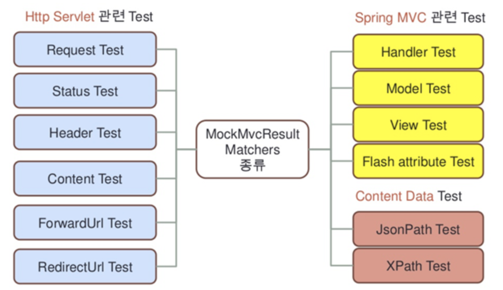

### 예제를 통해 알아보는 MockMVC Test

1. GuestbookApiController를 테스트하는 GuestbookApiControllerTest 클래스 작성
   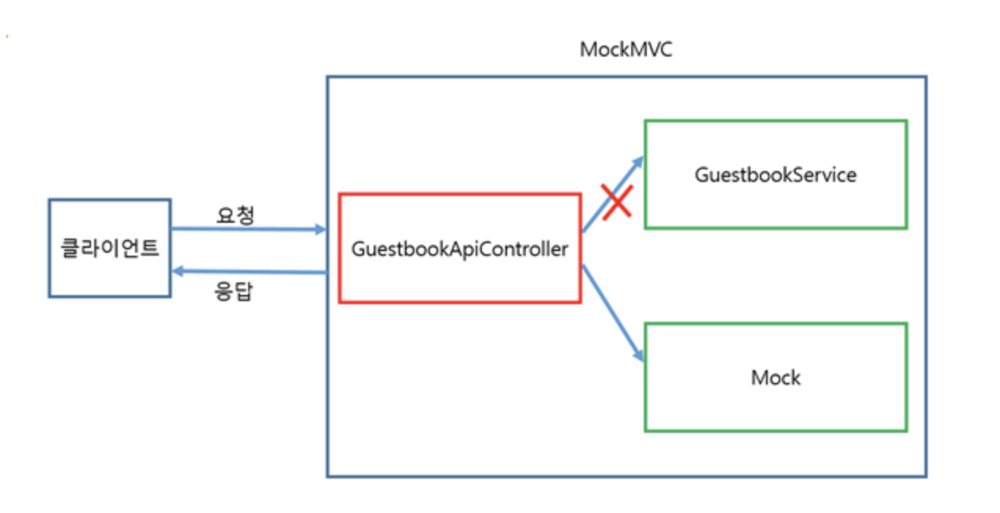
    - 단위테스트
        - GuestbookApiController를 단위 테스트한다는 것은, GuestbookApiController가 사용하는 GuestbookService에 대한 부분은 함께 테스트하지 않는다는 것을
          의미한다.
        - 이를 위해 `GuestbookService에 대한 목(Mock, 가짜)객체를 사용`할 것이고 `Mokito를 이용해 목(Mock, 가짜)객체를 생성`한다.

### json-jsonpath 라이브러리

1. REST 또는 Web API에서 받아지는 JSON 결과에 특정 값이 포함되어 있는지 확인하기 위해 사용하는 라이브러리
2. [JSON Path 위치 지정 방법 참고 링크 바로가기](https://restfulapi.net/json-jsonpath/) 